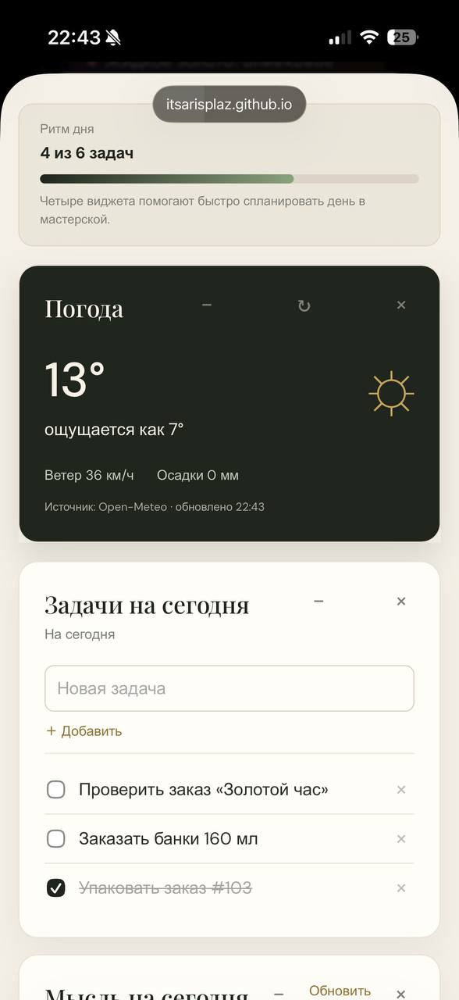
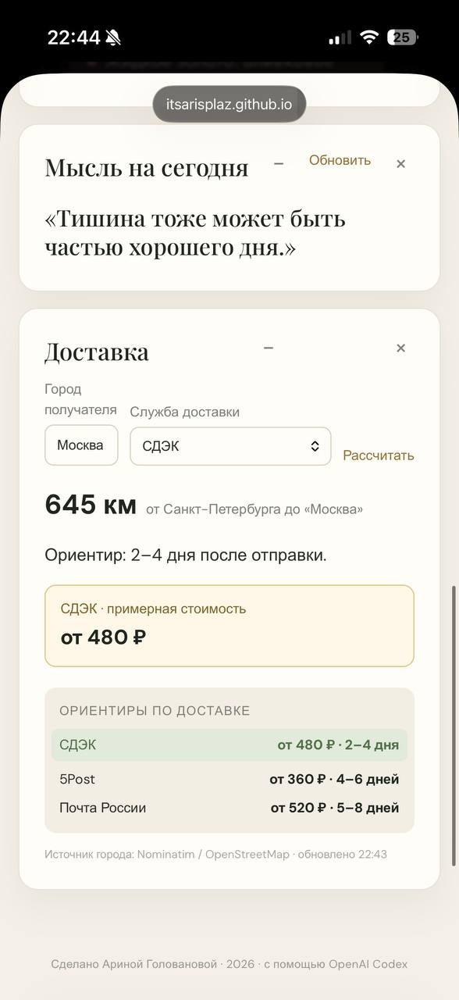
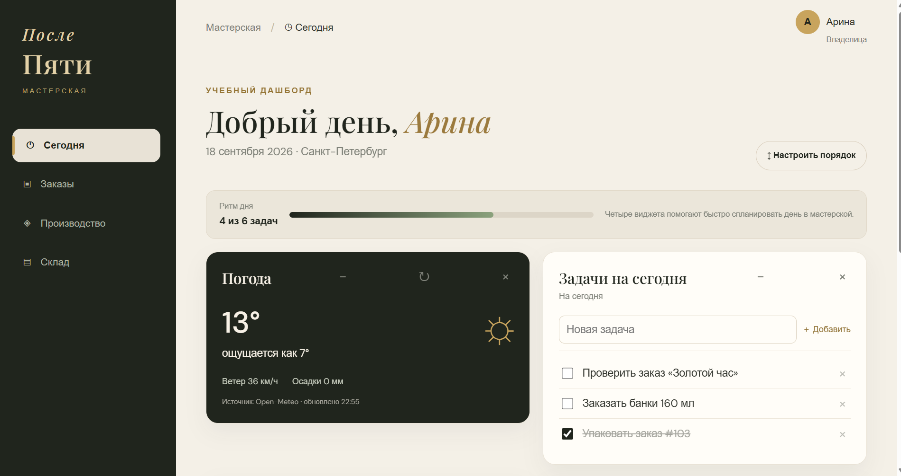
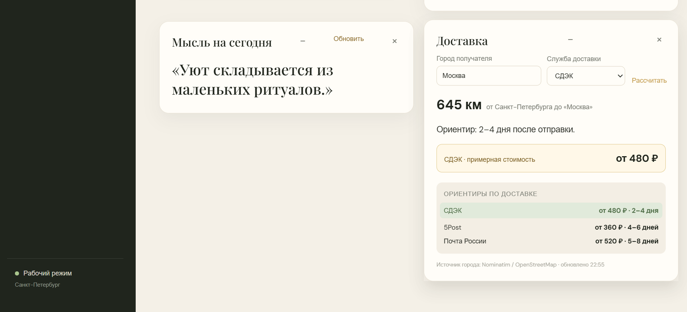

# Мастерская «После Пяти»

Учебное одностраничное веб-приложение — внутренний дашборд свечной мастерской бренда «После Пяти». Это реальный авторский бренд свечей Арины Головановой: в мастерской создаются ароматические свечи, изделия из гипса и подарочные наборы. У бренда уже есть действующий сайт с админкой, подключённой Метрикой и рабочим учётом; реальные данные и доступы из него намеренно не переносятся в этот учебный проект. Эта панель — самостоятельный учебный пример для Арины и небольшой команды: она показывает, как можно удобно организовать ежедневные задачи, заказы, производство, материалы и отправки в одном интерфейсе.

## Тема, пользователь и задача

**Тема:** внутренний дашборд «Мастерская “После Пяти”» для управления авторским свечным брендом.

**Для кого:** для Арины — владелицы бренда «После Пяти» — и небольшой команды, которая принимает заказы, изготавливает свечи, подготавливает контент, упаковывает и отправляет покупки клиентам.

**Какую задачу решает:** помогает быстро понять, что нужно сделать сегодня, какие заказы находятся в производстве, каких материалов не хватает, что нужно заказать и какие публикации запланированы. Это учебный рабочий дашборд, а не полноценная CRM или складская система: он показывает, как один понятный интерфейс может упростить ежедневную работу мастерской.

**Основные виджеты главного экрана:** `ToDoWidget` показывает задачи, `WeatherWidget` — погоду, `QuoteWidget` — локальную справочную карточку, а `DeliveryWidget` — расчёт доставки. Для темы мастерской также доступны вспомогательные рабочие экраны: заказы, производство, склад, закупки, календарь, статистика и продвижение. Они не увеличивают количество основных виджетов, а раскрывают рабочий контекст панели.

**Два API:**

- **Open-Meteo** — получает текущую погоду для Санкт-Петербурга;
- **Nominatim / OpenStreetMap** — находит город получателя и его координаты для расчёта расстояния.

`QuoteWidget` не обращается к API: это локальный учебный виджет с массивом цитат, который демонстрирует работу классов и динамическое управление компонентом.

## Планирование и визуальное решение

**Референсы:** при проектировании использовались три типа референсов: сайт бренда «После Пяти» как источник атмосферы и фирменного языка, современные светлые SaaS-дашборды как пример карточной сетки и аналитические панели с крупными показателями как пример иерархии данных. Референсы использованы для композиции и настроения, а не скопированы буквально.

**Палитра:** тёмный оливковый `#20251D` для навигации и акцентных состояний, молочный `#F4F0E7` для фона, почти белый `#FFFDF8` для карточек, приглушённое золото `#C8A45D` для действий и статусов, зелёный и терракотовый для состояний запаса.

**Типографика и интервалы:** заголовки используют выразительный serif-шрифт `Playfair Display`, основной текст — спокойный sans-serif `DM Sans` с системным запасным шрифтом. Базовый ритм — 8 px; основные отступы карточек — 18–22 px, расстояние между карточками — 14–18 px, скругление — 12–17 px.

**Простой эскиз:**

```text
Широкий экран:                 Мобильный экран:
┌──────┬──────────────────┐    ┌──────────────┐
│ меню │ Погода │ Задачи  │    │ Погода       │
│      ├──────────────────┤    ├──────────────┤
│      │ Мысль  │ Доставка│    │ Задачи       │
└──────┴──────────────────┘    ├──────────────┤
                               │ Мысль        │
                               ├──────────────┤
                               │ Доставка     │
                               └──────────────┘
```

Сначала проектировалось основное рабочее место из четырёх виджетов, затем были добавлены компактные рабочие экраны, чтобы не превращать учебный проект в полноценную CRM: они открываются отдельно и не перегружают главный экран.

## Мобильная версия





## Широкая версия





## Запуск

Проект состоит из статических файлов и не требует установки зависимостей. Откройте `index.html` через локальный веб-сервер из корня проекта. Например, в VS Code можно воспользоваться расширением Live Server.

## Публикация

Для GitHub Pages загрузите содержимое папки `publish` в корень репозитория: рядом должны лежать `index.html`, `main.js`, `main2.js`, папки `js` и `styles`. Затем в настройках GitHub Pages выберите ветку `main` и папку `/ (root)`.

## Архитектура

- `index.html` — HTML-оболочка приложения;
- `main.js` — точка входа ES6-модулей; запускает инициализацию Dashboard, переключение разделов и демонстрационные данные;
- `main2.js` — реализация текущей логики главного модуля, подключаемая из `main.js`;
- `js/UIComponent.js` — базовый класс виджета: хранит заголовок и id, регистрирует обработчики и корректно их очищает;
- `js/Dashboard.js` — коллекция активных виджетов, их создание и удаление;
- `js/ToDoWidget.js` — независимый список задач: встроенное поле ввода, добавление, удаление и отметка выполнения;
- `js/QuoteWidget.js` — смена случайной цитаты;
- `js/WeatherWidget.js` — погодный API-виджет;
- `js/DeliveryWidget.js` — API-виджет расчёта расстояния до города получателя;
- производство в `main2.js` — канбан по этапам с составом свечи и прогрессом;
- заказы в `main2.js` — фильтрация по статусам и состав заказа;
- склад в `main2.js` — фактические остатки материалов, тары, фитилей и упаковки;
- `QuoteWidget` — локальный учебный виджет с массивом цитат; он демонстрирует ООП и динамическое управление компонентами, но не является API-источником;
- `styles/main.css` — адаптивные стили.

На главном экране доступен режим «Настроить порядок»: карточки виджетов можно перемещать стрелками вверх/вниз или перетаскивать мышью. Выбранная композиция сохраняется в `localStorage` браузера; на мобильном экране используются компактные управляющие кнопки. В разделе «Склад» сначала показана сводка рисков, затем фильтры и отдельные секции материалов.

Виджеты наследуются от `UIComponent`. Dashboard применяет полиморфизм: хранит экземпляры общего типа и добавляет конкретный класс по названию виджета. При закрытии Dashboard вызывает `destroy()`, который удаляет обработчики; API-виджеты также отменяют активный запрос через `AbortController`.

## Источники данных

- [Open-Meteo](https://open-meteo.com/) — погода для Санкт-Петербурга;
- [Nominatim / OpenStreetMap](https://nominatim.openstreetmap.org/) — геокодирование города получателя для расчёта расстояния.

Оба источника не требуют секретного ключа. Полученные с API строки добавляются в DOM безопасно через `textContent`, а не через `innerHTML`.

Примеры запросов и используемые поля:

- Open-Meteo: `https://api.open-meteo.com/v1/forecast?latitude=59.9386&longitude=30.3141&current=temperature_2m,apparent_temperature,precipitation,wind_speed_10m`; используются `current.temperature_2m`, `current.apparent_temperature`, `current.precipitation` и `current.wind_speed_10m`.
- Nominatim: `https://nominatim.openstreetmap.org/search?format=jsonv2&limit=1&accept-language=ru&q=Москва`; используются `lat` и `lon` первого найденного места для расчёта расстояния.

Пробные запросы проверены до подключения интерфейса: Open-Meteo возвращает объект `current` с погодными полями, а Nominatim возвращает массив найденных мест с координатами `lat` и `lon`. Поэтому оба выбранных источника подходят для задачи и не требуют ключей.

После успешного ответа оба API-виджета показывают источник и время обновления. При ошибке показывается понятное сообщение и кнопка повторной попытки; если до ошибки уже был успешный ответ, последние данные остаются на экране и явно помечаются как устаревшие. При пустом результате выводится отдельное сообщение.

## Результаты проверки

Проверены работа двух API, выбор города и службы доставки, пустой поиск, повторная загрузка, адаптивные ширины 360/768/1280 px, клавиатурный фокус и отсутствие ошибок в консоли. На мобильном экране карточки выстраиваются в одну колонку.

## Ограничения

- Заказы, состав свечи, склад и производство используют демонстрационные данные в памяти браузера; после обновления страницы изменения не сохраняются. В заказе дополнительно показываются аромат и типоразмер фитиля с диаметром. Склад показывает факт наличия, включая упаковку по видам, цветам и размерам. Добавленные задачи хранятся до перезагрузки страницы. Порядок виджетов главного экрана — исключение: он сохраняется локально в `localStorage`.
- Расстояние показывает прямую линию от Санкт-Петербурга. Для СДЭК, 5Post и Почты России показываются учебные ориентиры стоимости и срока, рассчитанные по расстоянию; это не реальные тарифы перевозчиков.
- Для полноценного рабочего сервиса потребуются сервер, база данных, авторизация и подключение реальных сервисов доставки.

## Существенное применение ИИ

- Помощь в проектировании ООП-структуры и сценариев интерфейса.
- Создание черновой реализации модулей, стилей и демонстрационных данных.
- Проверка DOM, состояния API и базовой доступности через браузерную автоматизацию.

Все решения, предметная область, визуальное направление и данные бренда утверждались пользователем в ходе работы.
